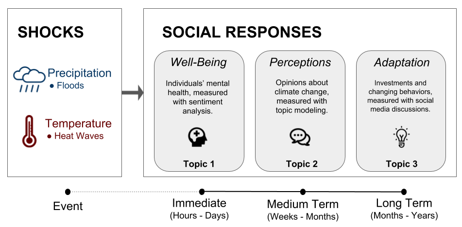

```{r setup, include=FALSE}

library(knitr)
library(tools)
opts_chunk$set(
  message = FALSE,
  warning = FALSE,
  cache = TRUE)
```

## Pursuit Project Idea


*Title: Understanding social responses to environmental shocks-A text mining approach*

Theme: Sudden and unexpected events

6 members (US, Africa and Asia)

## From Mini-project to Pursuit
{ width=100% }

Pursuit: Scoping stage with 3 sub projects

Mini project related to project 1: Looking at the relationship between weather and sentiment

Aim: Explore approaches for overall contribution to main project


## Data

Source: The Gdelt Project https://www.gdeltproject.org/

Description:

Format:

```{r load_data,context = 'data', echo = FALSE,results='hide',cache.extra = md5sum('T_data_CPC.R')}
source('T_data_CPC.R')
library(reshape2)
library(ggplot2)


```
--- 
```{r plot_T_map,echo = FALSE}
kable(allData[1:5,-5],caption = 'Data examples')
longData<-melt(lastdaymax)
longData<-longData[!is.na(longData$value),]

ggplot(longData, aes(x = Var1, y = -Var2)) + 
  geom_raster(aes(fill=value)) + 
  scale_fill_gradient(low="grey90", high="red") +
  labs(x="letters", y="LETTERS", title="Matrix") +
  theme_bw() + theme(axis.text.x=element_text(size=9, angle=0, vjust=0.3),
                     axis.text.y=element_text(size=9),
                     plot.title=element_text(size=11))
```


## Methods
- Scraping

- Regression
- Text mininig
- Interactive mapping

## Results and discussion


### Sentiment Analysis
```{r sentiment_analysis,eval=TRUE,echo=TRUE}

library(syuzhet)

allData$senti <- get_nrc_sentiment(allData$txt_content)
allData$sentiscore <- get_sentiment(allData$txt_content)
str(allData)

```

### Linear Regression

```{r regression,eval=TRUE }
model1 <- lm(
  formula = sentiscore ~ Tmin,
  data = allData)
summary(model1)
```

---
```{r load_map, echo = FALSE }
library(leaflet)

leaflet(data = allData[1:200,]) %>%
    addTiles() %>%
  addMarkers(~lon,~lat,
             #popup=~as.character(sentiscore), 
             label = ~as.character(city)) %>%
    setView(lng = -77, lat = 39, 
        zoom = 7)


```


